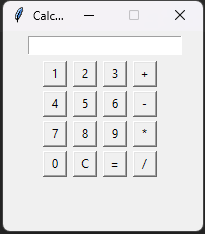

# Python Tkinter Calculator



## Overview

This project is a graphical calculator application developed using Python's Tkinter library. It provides a user-friendly interface for performing basic arithmetic operations.

## Features

- **Basic Arithmetic Operations**: Supports addition, subtraction, multiplication, and division.
- **Clear Functionality**: Includes a clear button to reset the input field.
- **Error Handling**: Displays error messages for invalid inputs or operations.

## Installation

1. **Clone the Repository**:

   ```bash
   git clone https://github.com/Levi-Michael/Python_Tkinter_Calculator.git
   ```

2. **Navigate to the Project Directory**:

   ```bash
   cd Python_Tkinter_Calculator
   ```

3. **Ensure Python is Installed**:

   This project requires Python 3.x. You can download it from the [official website](https://www.python.org/downloads/).

## Usage

1. **Run the Application**:

   ```bash
   python calc.py
   ```

2. **Using the Calculator**:

   - Enter numbers and select the desired operation using the provided buttons.
   - Click the '=' button to compute the result.
   - Use the 'C' button to clear the input field.

## Contributing

Contributions are welcome! Please fork the repository and create a pull request with your changes.

## Contact

Feel free to reach out for questions, collaboration opportunities or suggestions, open an issue or contact me directly through my [GitHub profile](https://github.com/Levi-Michael).
